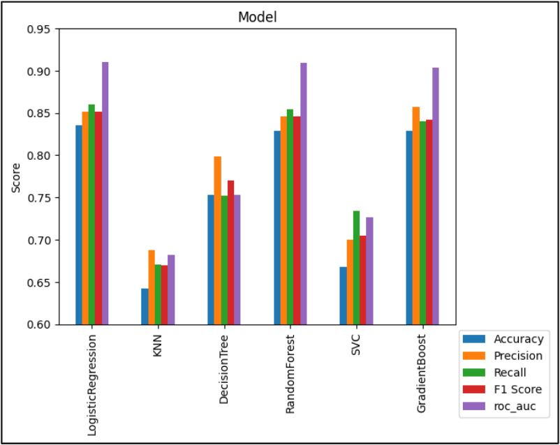

## Supervised Learning: Prediction Heart Disease
* Question: Can cardiovascular disease be predicted from other human features?
* Results: Logistic regression predicted cardiovascular disease with 86% recall and 83% accuracy

### Summary :speaker:
* Background
* Exploratory Data Analysis
* Models
* Results and Conclusion
* Applications
* Next Steps

  

### Background 
* Cardiovascular disease in most racial groups is the leading cause of death in the United States during 2018-2021.
* Studies exist on both preventing and predicting cardiovascular disease using several risk factors

### The Data :bar_chart:
This capstone project reviews patient data from 5 sources for a total of 918 data points to predict patients with heart disease
https://www.kaggle.com/fedesoriano/heart-failure-prediction

### Exploratory Data Analysis :paperclip: 
- [x] 11 features
- [x] No missing values
- [x] No duplicate values
- [x] Incorrect values were fixed
- [x] Used one hot encoding for categorical features
- [x] Explored histograms of features
- [x] Evaluated correlation for quantitative features 

### Data Modeling :bar_chart:
* Proceeded with all features for modeling
* Used 6 models with cross-validation 
* Metrics used: Accuracy, Precision, Wecall, F1 Score, ROC AUC. 
* Results were graded mainly on accuracy and recall

  

### Model Tuning :bar_chart:
* Gradient boost and Logistic regression were tuned, but the models did not improve.
* The Logistic Regression model performed the best overall. 
* The Gradient Boost model had higher precision and scored close to Logistic Regression on the other metrics.

### Applications:
This model can be utilized in medical offices to predict if a patient has heart disease. 

### Next steps:
* Interactions with the features can be input in the model. 
* Example: max heart rate times age can be used as a feature to include this biological interaction.
* If new patient data is published, the model can be updated with the new data. 

 

